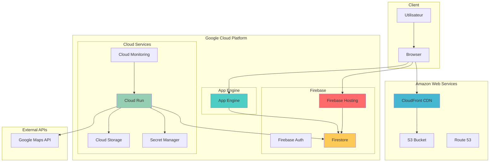

# Architecture TravelMate

## Vue d'ensemble

TravelMate est une application cloud-native construite avec une architecture microservices légère, déployée sur plusieurs fournisseurs cloud pour assurer la résilience et la performance.

## Diagramme d'architecture

## Composants principaux

### Frontend (Multi-cloud)
- **Firebase Hosting (GCP)** : Déploiement principal
- **App Engine (GCP)** : Déploiement alternatif
- **AWS S3 + CloudFront** : Déploiement de secours avec CDN

### Backend
- **Cloud Run (GCP)** : API REST containerisée
- **Firestore** : Base de données NoSQL temps réel
- **Cloud Storage** : Stockage des fichiers et médias

### Authentification
- **Firebase Auth** : Gestion des utilisateurs et tokens JWT
- **Google Sign-In** : Authentification sociale

### APIs externes
- **Google Maps Platform** : Cartes, géolocalisation, directions

## Flux de données

### Authentification
1. L'utilisateur se connecte via Google Sign-In
2. Firebase Auth génère un token JWT
3. Le token est utilisé pour authentifier les requêtes API

### Création de voyage
1. L'utilisateur crée un voyage via l'interface
2. Le frontend envoie la requête au backend Cloud Run
3. Le backend valide les données et les stocke dans Firestore
4. Les participants sont notifiés en temps réel

### Synchronisation temps réel
1. Firestore écoute les changements
2. Les clients connectés reçoivent les mises à jour automatiquement
3. L'interface utilisateur se met à jour sans rechargement

## Sécurité

### Authentification
- Tokens JWT Firebase
- Validation côté serveur
- Expiration automatique des tokens

### Autorisation
- Règles Firestore basées sur les utilisateurs
- Vérification des participants aux voyages
- Isolation des données par utilisateur

### Sécrets
- Variables d'environnement dans Secret Manager
- Clés API sécurisées
- Pas de secrets dans le code source

## Monitoring et observabilité

### Métriques
- Temps de réponse des API
- Taux d'erreur
- Utilisation des ressources
- Trafic utilisateur

### Logs
- Logs applicatifs dans Cloud Logging
- Traces des requêtes
- Erreurs et exceptions

### Alertes
- Notifications en cas de problème
- Seuils de performance
- Surveillance de la santé des services

## Scalabilité

### Auto-scaling
- Cloud Run s'adapte automatiquement à la charge
- Firestore gère la montée en charge automatiquement
- CDN distribue le contenu globalement

### Performance
- Cache CDN pour les assets statiques
- Optimisation des requêtes Firestore
- Compression des réponses API

## Résilience

### Multi-cloud
- Déploiement sur GCP et AWS
- Basculement automatique en cas de panne
- Redondance des services critiques

### Sauvegarde
- Sauvegarde automatique Firestore
- Réplication des données
- Plan de récupération d'urgence
